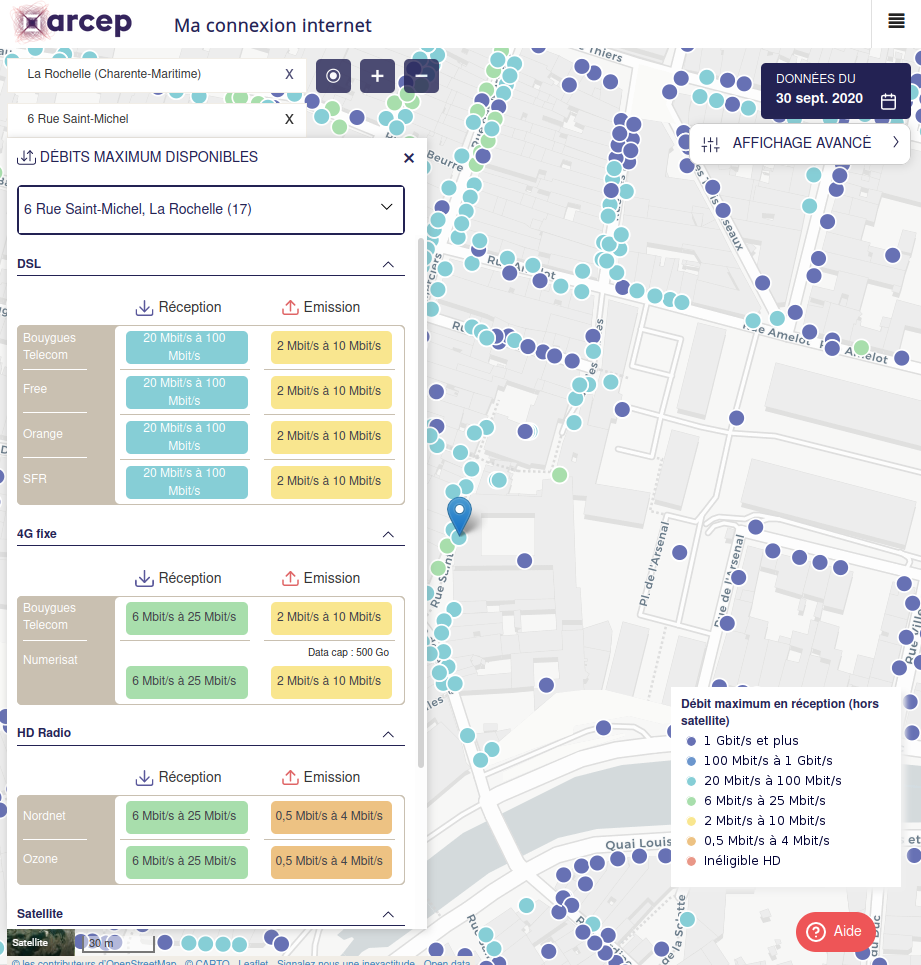
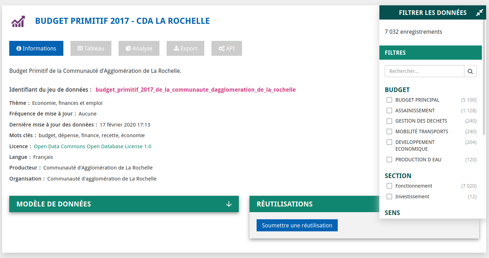
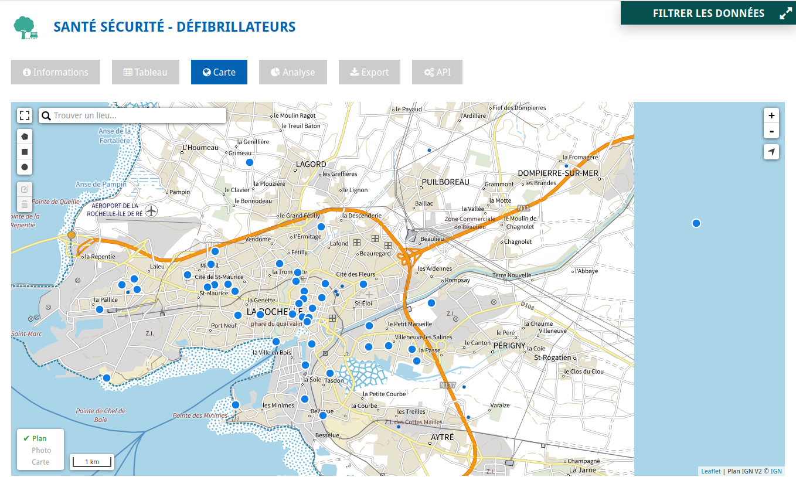
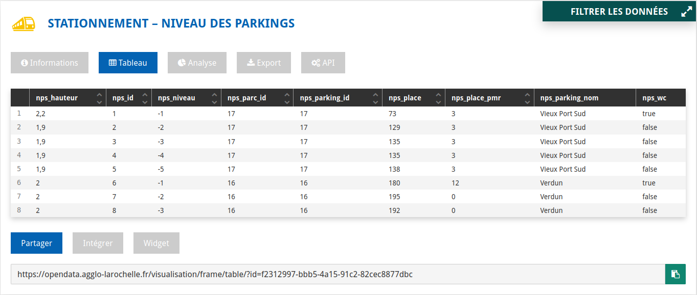
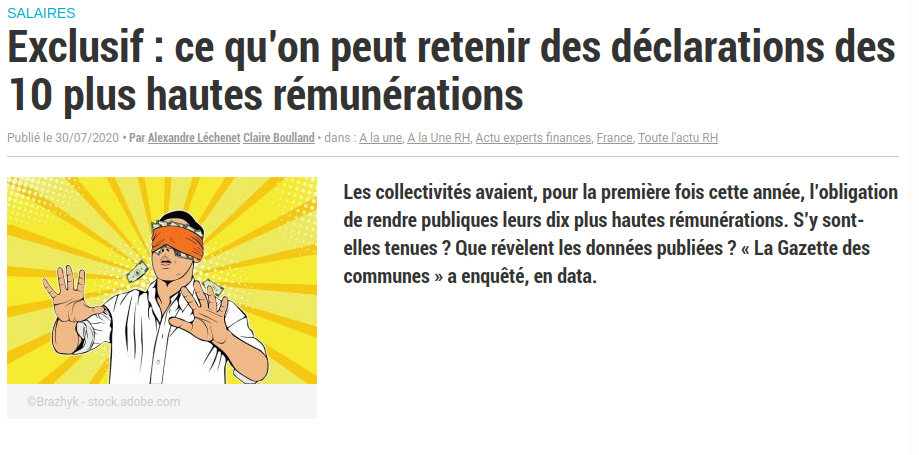
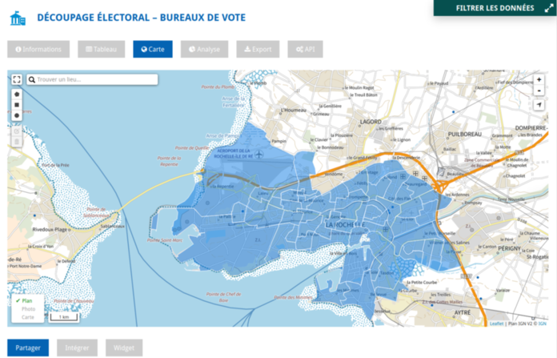
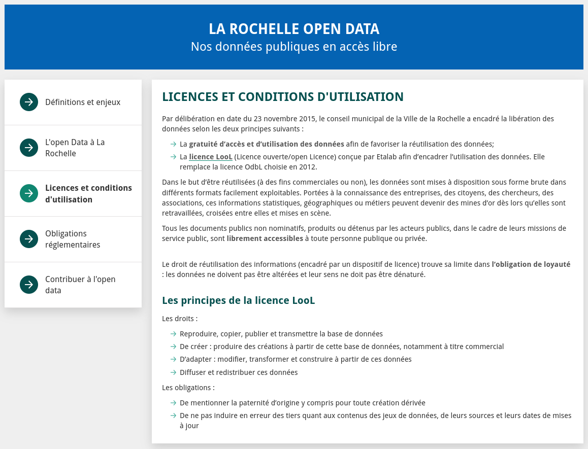
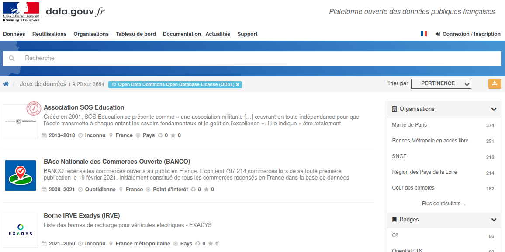
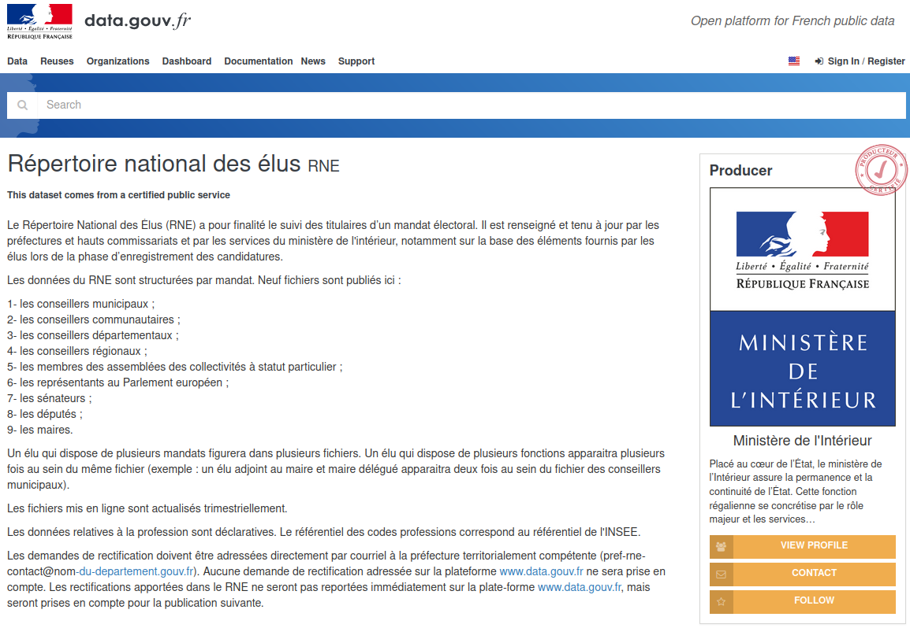
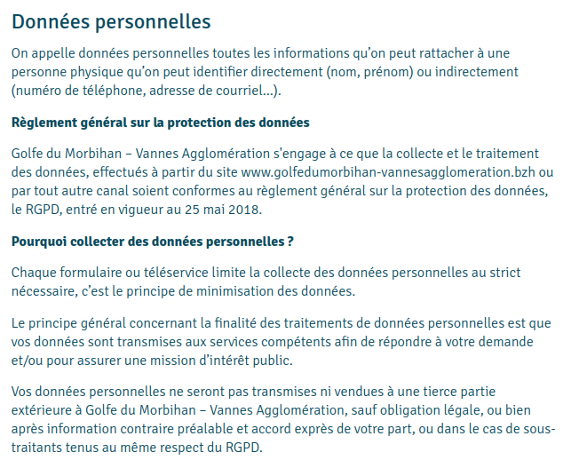

layout: true
  

`r paste0("
", params$event, " 

")` 

---

class: center, middle

Ces slides en ligne : `r paste0("http://datactivist.coop/", params$slug, "/", params$session)`

Sources : `r paste0("https://github.com/datactivist/", params$slug)`

Les productions de Datactivist sont librement réutilisables selon les termes de la licence [Creative Commons 4.0 BY-SA](https://creativecommons.org/licenses/by-sa/4.0/legalcode.fr).

 
 

.reduite[]

---

background-image: url("https://media.giphy.com/media/7TZvWKVkm0xXi/giphy.gif")
class: center, top, inverse

# Revenons sur les notions évoquées la semaine dernière

---

## Les données ouvertes : partager pour d'autres usages

.center[

]

---

## La Rochelle : ville pionnière de l'ouverture

.center[

]

---

## La plateforme open data comme outil

.center[

]

---

background-image: url("https://media.giphy.com/media/WRIWlMvurqWSA/giphy.gif")
class: center, top, inverse

# Commençons par un petit jeu

---

### Ouvert ? Obligatoire ? Les deux ?

Je vais vous citer une série de jeux de données.

Certains sont ouverts par l'agglomération de La Rochelle.

Certains doivent être publiés selon la loi.

Certains les deux.

D'autres ni l'un, ni l'autre !

--

A vous de répondre par chat :
* *ouvert* ;
* *obligatoire* ;
* *les deux* ;
* *ni l'un, ni l'autre*.

---

#### L'emplacement des défibrilateurs dans l'espace public

--

.center[

]

* *ouvert* &#9745; ([source](https://opendata.agglo-larochelle.fr/visualisation/map/?id=7b7933dc-0377-452a-85d5-9352f4a817b7&location=13,46.16543,-1.1238&basemap=Plan.ign.v2))

--

* *obligatoire* &#9745;

---

#### La hauteur sous plafond de chaque niveau de chaque parking de La Rochelle

--

.center[

]

* *ouvert*  &#9745; ([source](https://opendata.agglo-larochelle.fr/visualisation/table/?id=f2312997-bbb5-4a15-91c2-82cec8877dbc))

--

* *obligatoire*  &#9744; 

---

#### Les 10 plus gros salaires de l'agglo

--

* *ouvert*  &#9744; (en cours d'ouverture)

--

* *obligatoire* &#9745; (source image : [La Gazette des communes](https://www.lagazettedescommunes.com/690398/exclusif-ce-quon-peut-retenir-des-declarations-des-10-plus-hautes-remunerations/?abo=1))

.center[

]

---

#### L'emplacement des bureaux de vote

--

.center[

]

* *ouvert*  &#9745; ([source](https://opendata.agglo-larochelle.fr/visualisation/map/?id=d26f740e-b34c-4b36-b2a2-d379143a9ede&location=13,46.16848,-1.18827&basemap=Plan.ign.v2))

--

* *obligatoire* &#9744;

---

background-image: url("https://media.giphy.com/media/l3vRlpzIlIr6wVdPW/giphy.gif")
class: center, top, inverse

# 1 - Les données ouvertes dans le droit

.footnote[
## De la Cada à la Loi République numérique
]

---

### La Déclaration des Droits de l'Homme et du Citoyen de 1789

.right[
.quote[Art. 15. La Société a le droit de demander compte à tout Agent public de son administration.]
]

Source : [Legifrance](https://www.legifrance.gouv.fr/contenu/menu/droit-national-en-vigueur/constitution/declaration-des-droits-de-l-homme-et-du-citoyen-de-1789).

--

La formalisation juridique s'est opérée sur deux niveaux différents :
* une demande de la société civile visant à formaliser des critères correspondant à des besoins et des revendications politiques ;
* une évolution juridique internationale établissant de nouvelles normes d'information publique spécifiques aux données.

---

class: center, middle, inverse

## 1. L'émergence d'une demande d'ouverture

---

### 2005 : [Open Definition](https://opendefinition.org/)

#### Une définition juridique des droits de l'usager à un savoir ouvert\*

.center[]

.footnote[\*impulsée par Open Knowledge Foundation.]

---

### 2007 : [la rencontre de Sebastopol ](https://opengovdata.org/)

.pull-left[
**Quoi ?** Une rencontre de l'Open Governement Group à Sebastopol (Californie), siège des éditions O'Reilly

**Pourquoi ?** : Influencer le futur président des Etats Unis pour faire avancer l'open data

**Comment ?** En adoptant une déclaration définissant les grands principes de l'Open Government Data 

]

.pull-right[

]
---

## Revue des principes

(en bref)

1. des données complètes ;
2. Des données primaires ;
3. Des données fraiches (à jour) ;
4. Des données accessibles ;
5. Des données exploitables par les machines ;
6. Des données non discriminatoires (qui ne nécessitent pas des paramètres, autorisations spéciales, enregistrement préalable) ;
7. Des données dans un format ouvert ;
8. Des données dans une licence ouverte.
---
### 2008 : Tim Berners-Lee ["Raw data now"](https://www.ted.com/talks/tim_berners_lee_on_the_next_web?language=fr)
#### La demande de données brutes sous les projecteurs

.reduite[.center[

]]
---
### 2010 : [le modèle en 5 étoiles de Tim Berners-Lee](https://5stardata.info/fr/)

.reduite[.center[]]

---
## Des principes techniques sans portée politique
>"Il peut être vrai en un sens qu'un régime devient plus ouvert chaque fois qu'il fournit des données ouvertes supplémentaires, même pour les sujets banals et apolitiques, mais il est facile d'imaginer qu'un régime fermé pourrait divulguer de grandes quantités de données conformes à ces huit exigences [de Sébastopol] **sans pour autant accroître sa responsabilité réelle en tant que gouvernement **. 

> Une diffusion électronique des déclarations de propagande faites par les dirigeants politiques de la Corée du Nord, par exemple, pourrait satisfaire à ces huit exigences et ne pas promouvoir une transparence ou une responsabilité supplémentaires de la part d'un régime notoirement fermé et opaque."

>Yu & Robinson (2012) « [The New Ambiguity of Open Government](https://papers.ssrn.com/sol3/papers.cfm?abstract_id=2012489) » 

---

class: center, middle, inverse

## 2. La création d'un cadre juridique international

---

background-image: url("https://media.giphy.com/media/h8WAdB9nUdraM/giphy.gif")
class: center, top

### 2011 : [à l'ONU, Barack Obama initie le Partenariat pour un gouvernement ouvert](https://obamawhitehouse.archives.gov/open/partnership)

---

### 2013 : la [charte du G8 sur l'open data](https://www.modernisation.gouv.fr/sites/default/files/fichiers-attaches/charte-g8-ouverture-donnees-publiques-fr.pdf)

---

### 2015 : la [charte internationale de l'open data]()
.reduite[.center[

]]

---

class: center, middle, inverse

## 3. Le cadre légal français

---

### 1978 : La loi CADA, vers le "droit de savoir"

* Le fondement : la .red[Déclaration des Droits de l'Homme et du Citoyen de 1789] dans son article 15, "la Société a le droit de demander compte à tout Agent public de son administration." 

* Le droit d'accès des citoyens à l'information publique émerge en **1978 avec la loi dite CADA** du nom de la Commission d'Accès aux Documents Administratifs. 

* La France était le .red[3e pays au monde] après la Suède en 1766 et les Etats-Unis avec le Freedom of Information Act (FOIA) en 1966  à accorder un "droit de savoir" avec pour but d'améliorer les relations entre le public et l'administration.

.footnote[Il faudrait maintenant désigner la loi comme le Code des relations entre le public et l'administration (CRPA) qui, dans son [livre 3](https://www.legifrance.gouv.fr/affichCode.do;jsessionid=BDF8EC0BD562E214CCD9A5ADD435D690.tplgfr42s_1?idSectionTA=LEGISCTA000031367685&cidTexte=LEGITEXT000031366350&dateTexte=20190429), codifie le droit d'accès et de réutilisation mais il est encore moins connu que la loi CADA…]

---

### La loi CADA : un point noir dans la transparence de la vie publique

Même si la France est le 3e pays à avoir adopté un droit d'accès, la loi CADA n'est pas un outil fort de la transparence de la vie publique. Ses principaux défauts : l'absence de sanctions et une procédure longue qui décourage les demandeurs et favorise le contournement par les administrations. 

---

### Les conditions d'exercice du droit d'accès

.red[ Une définition très large des documents administratifs]
> Les documents administratifs peuvent revêtir de nombreuses formes (dossiers, rapports, études, comptes rendus, procès-verbaux, statistiques, directives, instructions, circulaires, codes sources, etc.) et adopter tout support (écrit, enregistrement sonore ou visuel, forme numérique ou informatique). 

Le droit d'accès s'appplique aux documents administratifs produits dans le cadre d'une .red[mission de service public] ie :
> Une mission d'intérêt général sous le contrôle de l'administration et qui est dotée à cette fin de prérogatives de puissance publique est chargée de l'exécution d'un service public. 

Il ne s’exerce que si l’administration a effectivement en sa possession le document demandé, que si le document est formellement **achevé**, qu'il existe et qu'il n'est pas **préparatoire à une décision administrative** en cours. 

---

### Les exclusions au droit d'accès

Le droit d'accès .red[**ne doit pas porter atteinte aux secrets protégés**] : 
- le fonctionnement de l'État : délibérations du Gouvernement, secret de la défense nationale, la conduite de la politique extérieure de la France, la sûreté de l'État…
- la protection de la vie privée (nous y reviendrons précisément en partie 3)
- le secret médical
- le secret des affaires (secret des procédés, des informations économiques et financières et
des stratégies commerciales ou industrielle)
- les mentions portant une appréciation ou un jugement de valeur sur une personne physique ou
faisant apparaître un comportement d'une personne pouvant lui porter préjudice…

Le document ne peut être publié qu'après avoir fait l'objet d'un traitement permettant
d'.red[**occulter les mentions protégées**]. L’administration n’est pas tenue de publier un document lorsque “les travaux d’occultation dénatureraient ou videraient de sens le document” ou si “le document est indivisible ou l’occultation est trop complexe”.

---

### Loi pour une République Numérique : l'ouverture des données par défaut

Promulguée le 7 octobre 2016, après 4 ans d'annonces et de consultation, le titre 1 de la [loi pour une République  Numérique](https://www.legifrance.gouv.fr/affichTexte.do;jsessionid=B5632993E54F7CCC2606664B64CDF612.tpdila11v_1?cidTexte=JORFTEXT000033202746&categorieLien=id) porte sur l'ouverture des données publiques. 

La loi impose un principe d'.red[**ouverture des données par principe**] qui ne fait pas l'objet de sanctions à toutes les administrations, les entreprises délégataires d'une mission de service public et les .red[**collectivités locales de plus de 3500 habitants et 50 agents**]. 

L'ouverture concerne un .red[**périmètre très large**] : 
* les documents communiqués suite à des demandes CADA
* les "bases de données"
* les données "dont la publication présente un intérêt économique, social, sanitaire ou environnemental".
Rares sont donc les données publiques qui ne sont pas concernées par cette obligation d'ouverture. 

---

### La définition des données

Le guide CADA-CNIL rappelle la **définition des "bases de données"**

> On entend par base de données un recueil d'œuvres, de données ou d'autres éléments indépendants, disposés de manière systématique ou méthodique, et individuellement accessibles par des moyens électroniques ou par tout autre moyen (art L112-3 du code de la propriété intellectuelle)

> En d’autres termes il s’agit d’un ensemble de données organisé en vue de son utilisation par des programmes correspondant à des applications distinctes et de manière à faciliter l'évolution indépendante des données et des programmes (en anglais : data base)

Le document donne également une **définition de ce qu'est une "donnée"** :

> Une donnée correspond à la représentation d'une information sous une forme conventionnelle destinée à faciliter son traitement (en anglais : data).

---

### La question des standards de données

Les standards sont des conventions portant sur **la forme** des jeux de données :

* le type de fichier ;
* la structure du fichier : que contiennent les lignes ? A quoi correspondent les colonnes ?
* la structure des données : comment la date est-elle rédigée ? Utilise-t-on un système de code particulier pour les couleurs, les pays, les coordonnées géogrpahiques, etc.

--

Afin de faciliter la réutilisation des données par les machines, la loi pour une République Numérique consacre **l'utilisation de standards ouverts** pour la communication des documents administratifs. 

L’administration est dorénavant tenue, lorsqu’elle communique un document administratif au format électronique, de le mettre à disposition du citoyen **"dans un standard ouvert, aisément réutilisable et exploitable par un système de traitement automatisé"**. 

L'idée est de privilégier, quand c'est possible, un format facile à manipuler par une machine (comme le **CSV** ou le **Excel**) à des formats documentaires non traitables (comme le **PDF**).

---

### L'enjeu des licences

Les licences constituent un enjeu politique fort : comme pour un établissement de commerce exercant une activité réglementée (la distrubtion d'alcool, par exemple), la licence d'un jeu de données détermine les usages possibles du jeu de données sur laquelle elle est aposée.

--

La loi **limite par décret les licences** qui peuvent être utilisées par les administrations. Le [décret du 27 avril 2017](https://www.legifrance.gouv.fr/eli/decret/2017/4/27/2017-638/jo/texte) autorise deux licences : 

* la Licence Ouverte d'Etalab : qui autorise un usage et une republication privative.

* la licence ODbL (Open Database License) : qui oblige à garder les réutilisations, républications dans une licence ouverte.

Ces deux licences offrent **un choix aux administrations** : ouvrir à tout usage ou contribuer à un "*pot commun*" de données.

---

### Les licences en résumé

.reduite.center[

]
.footnote[source : [SGAR Occitanie](http://www.opendatalab.fr/index.php/laboratoire/le-kit-collectivites)]

---

### Les licences utilisées par open data La Rochelle

[
.center[

]
](https://opendata.agglo-larochelle.fr/la-demarche?article=licences-et-conditions-d-utilisation)

---

### Jetons un oeil aux données dispo en Odbl

Source : [data.gouv.fr](https://www.data.gouv.fr/fr/datasets/?license=odc-odbl) où il est possible de faire des recherches par licence.

---

background-image: url("https://media.giphy.com/media/1mhNoEF2qRTllNqx1r/giphy.gif")
class: center, top, inverse

# 2 - Les obligations des collectivités

---

### Les collectivités concernées

Rappel des critères : plus de 3500 habitant·es et plus de 49 agent·es.

--

L'association Open Data France a évalué à 4604 les collectivités concernées par l'obligation d'ouverture. [Dans son dernier Observatoire de l'open data des territoires](https://www.opendatafrance.net/2020/10/15/observatoire-open-data-des-territoires-edition-oct-2020/) (octobre 2020), elle comptait 503 collectivités ayant au moins publié un jeu de données, soit moins de 11% du total. Remarquant une relation forte entre la taille des administrations et leur niveau d'ouverture :

.center[
]

---

### Les obligations de publication

Depuis le 7 octobre 2018, les collectivités territoriales se voient dans l'obligation de respecter le principe de **.red[l'open data par défaut]**.

Nous pouvons dégager cinq catégories (cf. [la synthèse qu'en fait la Cnil](https://www.cnil.fr/fr/les-collectivites-territoriales-et-lopen-data-concilier-ouverture-des-donnees-et-protection-des)) :

> * les documents qu'elles communiquent en application des procédures prévues par le CRPA, ainsi que leurs versions mises à jour ;
* les documents qui figurent dans le répertoire des informations publiques (RIP) ;
* les bases de données, mises à jour de façon régulière, qu'elles produisent ou qu'elles reçoivent et qui ne font pas l'objet d'une diffusion publique par ailleurs ;
* les données, mises à jour de façon régulière, dont la publication présente un intérêt économique, social, sanitaire ou environnemental.
* les règles définissant les principaux traitements algorithmiques utilisés dans l'accomplissement de leurs missions, lorsque ces traitements fondent des décisions individuelles.

---

### Cas particulier : la commande publique

Deux arrêtés fixent les modalités de publication des données essentielles de la commande publique (DECP) :
* l'[arrêté du 14 avril 2017](https://www.legifrance.gouv.fr/jorf/id/JORFTEXT000034492587?r=Uf7YJqzL34) relatif aux données essentielles dans la commande publique
* l'[arrêté du 27 juillet 2018](https://www.legifrance.gouv.fr/jorf/id/JORFTEXT000037282994/) modifiant l'arrêté du 14 avril 2017 relatif aux données essentielles dans la commande publique.

Entrés en vigueur le 1er octobre 2018, ils instaurent l'obligation de publication des DECP sur leurs profils acheteurs pour tous les marchés supérieurs à 40000 euros aux 70000 acheteurs publics français : ministères, hôpitaux, etc. et, bien sûr, collectivités territoriales.

Autre particularité : cette obligation s'accompagne d'un format réglementaire. Celui-ci est décrit sur le site [schema.data.gouv.fr](https://schema.data.gouv.fr/139bercy/format-commande-publique/latest.html).

---

### Cas particulier : les hauts salaires

.pull-left[Au 1er mai 2020, les collectivités territoriales de plus de 80000 habitant·es et EPCI à fiscalité propre couvrant un même périmètre devaient publier sur Internet la somme des dix rémunérations les plus hautes des agents qu'elles employaient ainsi que la répartition entre hommes et femmes.

Cette disposition visant à s'aligner sur les standards de transparence du privé et à permettre la production d'un rapport sur les hautes rémunérations a, [d'après le site La gazette des communes](https://www.lagazettedescommunes.com/690398/exclusif-ce-quon-peut-retenir-des-declarations-des-10-plus-hautes-remunerations), été peu suivie :
]

.pull-right[

> *"A ce jour, ont pu être extraites, parfois non sans peine, les données de 21 communes (sur 58 communes concernées), 33 départements et 9 régions."*]

---

### Les schémas réglementaires

La mission Etalab a initié une démarche de centralisation des schémas de données réglementaires sur le site [schema.data.gouv.fr](https://schema.data.gouv.fr/documentation/schemas-reglementaires).

Y sont référencés les schémas justifiés par voie réglementaire (et les textes de référence associés) ou par voie d'usage.

O peut y trouver :
* [le schéma de déclaration de profil acheteur pour la commande publique](https://schema.data.gouv.fr/etalab/schema-decp-dpa/latest.html) ;
* [le schéma des données de subvention publique](https://schema.data.gouv.fr/scdl/subventions/latest.html) ;
* [le schéma infrastructure de rechargement de voiture électrique (IRVE)](https://schema.data.gouv.fr/etalab/schema-irve/latest.html) ;
* et beaucoup d'autres !

---

background-image: url("https://images.milledcdn.com/2018-04-27/-Z48IfjAS0P9ktDo/S2y8kuItyKuC.gif")
class: center, top, inverse

# 3 - Le RGPD et les données personnelles

.footnote[Crédit GIF : [Milled](https://milled.com/missguided-aus/wtf-is-gdpr-iiiPNZ86rPlDLGcB).]

---

background-image: url("https://media.giphy.com/media/yow6i0Zmp7G24/giphy.gif")
class: center, top, inverse

## Une donnée personnelle ?

---

## Proposition de définition

---

### Un cadre légal portant sur les usages

Le premier cadre légal est posé en France par la Loi Informatique et Liberté (LIL), surtout connue pour avoir donné naissance à la Commission Nationale Informatique et Liberté (Cnil).

.quote[La protection légale porte sur l'usage des données et non pas sur les données elles-mêmes.]

---

### Le RGPD

Le RGPD s'exerce sur toutes les organisations privées ou publiques établies ou ayant des activités en lien avec l'Union européenne.

Elle vise à encadrer l'usage des données afin de garantir quelques principes :

1. la finalité : les données sont collectées dans un but donné et de manière minimale (juste ce dont on a besoin) ;
2. la transparence : les individus doivent être informés de la manière dont sont utilisées leurs données **dès la collecte** ainsi que de leurs droits en la matière ;
3. l'accès au droit : l'organisation doit faciliter l'exercice des droits des individus sur leurs données ;
4. la durée de conservation : dans la continuité de l'esprit de *finalité*, les données doivent avoir une date de conservation limitée et guidée par l'usage ;
5. la sécurité : l'organisation doit garantir la sécurité des données pour éviter d'exposer les individus qu'elles concernent.

---

background-image: url("https://media.giphy.com/media/wDGCA2dv9VJxC/giphy.gif")
class: center, top, inverse

### Et vous, utilisez-vous des données personnelles ? Lesquelles ? A quelles fins ?

---

class: center, top, inverse

### Peut-on publier des données personnelles ?

---

### Oui mais à des conditions bien précises

La mise en ligne de données à caractère personnel sans anonymisation n'est permise que dans .red[**trois cas**] :
1. une disposition législative contraire le prévoit (exemple : [Transparence Santé](https://www.data.gouv.fr/fr/datasets/transparence-sante-1/))
2. si les personnes intéressées ont donné leur accord (consentement au sens de l’article 4 du RGPD)
3. les documents relevant de [l’article D312-3-1 du CRPA](https://www.legifrance.gouv.fr/affichTexte.do;jsessionid=51E99AF738C12521572D6A7F6C8C03E8.tplgfr23s_1?cidTexte=JORFTEXT000037797147&dateTexte=&oldAction=rechJO&categorieLien=id&idJO=JORFCONT000037796937)

Hors de ces cas, il faut .red[**anonymiser les données**].

.center[]

---

### Ex. le registre national des élu·es ([RNE](https://www.data.gouv.fr/en/datasets/repertoire-national-des-elus-1/))

---

background-image: url("https://media.giphy.com/media/5too9Q3cCrlzGyogZl/giphy.gif")
class: center, top, inverse

### Connaissez-vous votre délégué à la protection des données (DPO) ?

---

### Je vous présente ...

---

### Je vous présente ... Christian Plantin !

* diplômé de l'Ecole nationale des ingénieurs de Brest en 1999 ;
* arrivé à La Rochelle en 2006 en tant que responsable réseaux ;
* délégué à la protection des données depuis la mutualisation ville / agglo.

Il est votre référent pour :

* l'information sur les données personnelles ;
* le conseil dans les traitements ;
* la mise en conformité avec la loi.

---

background-image: url("https://media.giphy.com/media/igc5uNcbppPRURODnq/giphy.gif")
class: center, top, inverse

### Quelles questions voudriez-vous poser à Christian ?

--

.footnote[Hé ben, ça tombe bien, voici son mail :
[christian.plantin@agglo-larochelle.fr](mailto:christian.plantin@agglo-larochelle.fr)]

---

## Des droits

---

.pull-left-wide[### Exemple d'information : l'agglo de Vannes
]

.pull-right-narrow[]

Vannes Agglomération propose une information détaillée sur le traitement des données personnelles et les droits des administré·es [dans ses mentions légales](https://www.golfedumorbihan-vannesagglomeration.bzh/mentions-legales) :

.center[

]

---

background-image: url("https://media.giphy.com/media/TgF6xfH8V0mZcUyneP/giphy.gif")
class: center, top, inverse

### Avez-vous des questions ?

---
class: inverse, center, middle

# Merci !

Contact : [sylvain@datactivist.coop](mailto:sylvain@datactivist.coop)
