layout: true
  

`r paste0("
", params$event, " 

")` 

---

class: center, middle

Ces slides en ligne : `r paste0("http://datactivist.coop/", params$slug, "/", params$session)`

Sources : `r paste0("https://github.com/datactivist/", params$slug)`

Les productions de Datactivist sont librement réutilisables selon les termes de la licence [Creative Commons 4.0 BY-SA](https://creativecommons.org/licenses/by-sa/4.0/legalcode.fr).

 
 

.reduite[]

---

background-image: url("https://media.giphy.com/media/5e7IgAQL94d6ooCi43/giphy.gif")
class: center, top, inverse

# Où en est-on de notre parcours ?

---

## Il y a deux semaines

* les données sont partagées pour être utilisées ;
* La Rochelle a fait partie des territoires pionniers dès 2012 en créant une infrastructure physique et numérique pour publier les données ;
* en 2021, elle franchit un nouveau pas avec un portail qui mutualise les données de la Communauté d'Agglomération et offre de nouvelles fonctionnalités : [open data agglo La Rochelle](https://opendata.agglo-larochelle.fr/accueil).

---

## La semaine dernière

* la législation sur les données puise sa source dans le *"droit de savoir"* (Constitution) et le *"droit à l'information"* ;
* la Loi République Numérique instaure l'ouverture des données *"par défaut"* avec des obligations pour les agglomérations, notamment sur les formats et les licences sous lesquelles les données doivent être publiées ;
* le Règlement général sur la protection des données (RGPD) renforce la protection des données à caractère personnel en encadrant strictement leur collecte, leur détention, leur partage et leur usage. Une personne à la CdA, Christian Plantin (le DPO) a pour tâche de vous informer et vous accompagner sur ces sujets.

---

background-image: url("https://media.giphy.com/media/wfOe7SdZ3XyHm/giphy.gif")
class: center, top, inverse

## Reste une question centrale ...

--

## ... comment publier des données ?

---

background-image: url("https://media.giphy.com/media/fGnOsyxUerfspkyVjv/giphy.gif")
class: center, top, inverse

# 1 - Le besoin de données

---

background-image: url("https://media.giphy.com/media/VFNImnHckfBKHZDOIV/giphy.gif")
class: center, top, inverse

## Mettons d'abord une chose au clair

---

class: center, top, inverse

## Personne n'a *besoin* de données ...

--

## ... mais tout le monde les utilise.

---

### Besoin de données <= usage de données

Il est très difficile d'identifier .blue-h[un besoin de données] dans l'absolu : la donnée étant utilisé comme composant, il est généralement plus simple de partir du résultat attendu.

D'où ma question :

--

.center[
### Quand avez-vous *utilisé* des données pour la dernière fois ?
]

---

### Un usage => plusieurs besoins

.pull-left[

Quels besoins sont générés par cet usage ?

.center[

]
]

--

.pull-right[
Pour l'itinéraire :
* les horaires des différents modes ;
* l'emplacement des arrêts ;
* le tracé des axes ;
* le tracé des pistes cyclables ;
* la carte (pour l'affichage en mode carte) ;
* ...

Et .blue[les données de l'usager].
]

---

### Des données produites => des usages

La mise à disposition de données peut également générer des usages non prévus au départ.

--

Exemple : 

.pull-left[#### [Le fichier des personnes décédées](https://www.data.gouv.fr/en/datasets/fichier-des-personnes-decedees/)

.center[
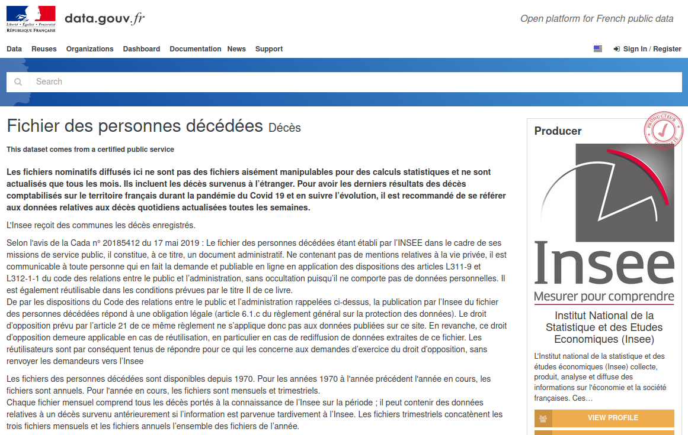
]
]

.pull-right[#### [Une enquête sur la Covid](https://www.rue89strasbourg.com/la-surmortalite-en-alsace-pendant-la-periode-covid-vue-depuis-les-chiffres-de-linsee-177809)

.center[
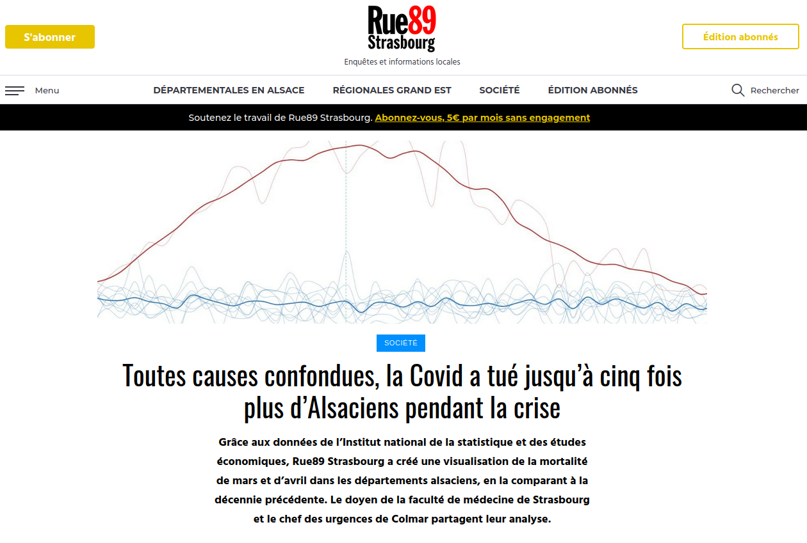
]
]

--

.red[Publier des données peut se faire sans identifier au préalable un usage : il arrive que la publication créé le besoin.]

---

### Exercice: usages/besoins/capacités

Pour mieux savoir où nous en sommes, je vous propose un exercice collectif pour identifier :

1. **les usages de données** ;
2. **les besoins de données** ;
3. **les productions de données**.

Votre tâche va consister à ajouter une note par élément et de voir si d'autres notent peuvent y être reliées, quels éléments manquent et comment combler ces vides.

--

Et pour ça, rendez-vous [sur Padlet](https://padlet.com/datactivist/webinaire_cdalr_module3) !

.center[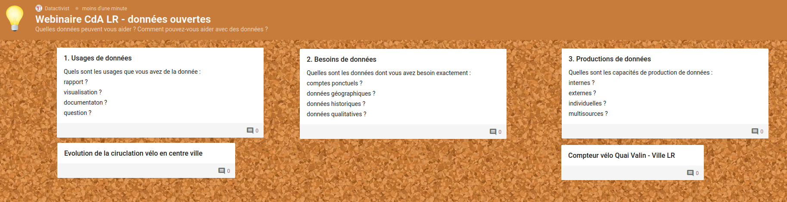]

---

background-image: url("https://media.giphy.com/media/xT9C25UNTwfZuk85WP/giphy.gif")
class: center, top, inverse

# 2 - Publier des données à La Rochelle

---

background-image: url("https://media.giphy.com/media/fdLI0oIxT5dM4/giphy.gif")
class: center, top, inverse

## Connaissez-vous la cheffe de projet open data de la CdA ?

--

### MAIS OUI, C'EST JUSTINE !

---

### Le rôle de la cheffe de projet open data

1. sensibiliser en interne ;
2. mettre en place la feuille de route ;
3. accompagner les métiers ;
4. publier les données ;
5. organiser l'animation autour de la plateforme.

Je n'oublie rien Justine ?

---

## Comment ça se passe en pratique ?

La publication des données est un processus .yellow-h[administratif], .blue-h[technique] et **politique**.
1. .yellow-h[la collecte de besoin] ;
2. l'analyse des besoins sur un plan .blue-h[technique] et .yellow-h[pratique] ;
3. **la validation en revue de projet et la programmation** ;
4. la préparation des données visant à assurer .yellow-h[les bonnes conditions de partage] et .blue-h[leur conformité aux besoins et spécificité de la plateforme] ;
5. la .blue-h[publication] à proprement parler (c'est-à-dire la mise à disposition] ;
6. .yellow-h[l'animation et la communication] autour des données]

---

### Le schéma de publication

.pull-left[
Pour le populariser auprès des équipes de la CdA, nous l'avons formalisé sous forme du schéma suivant :
]

.pull-right[
.center[
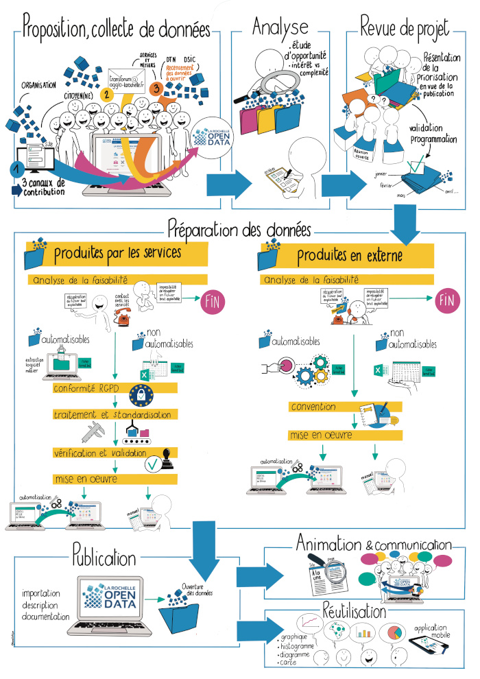

]
]

---

### Première étape : l'identification et la validation

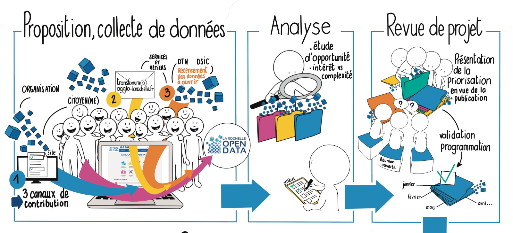

---

### Deuxième étape : la préparation

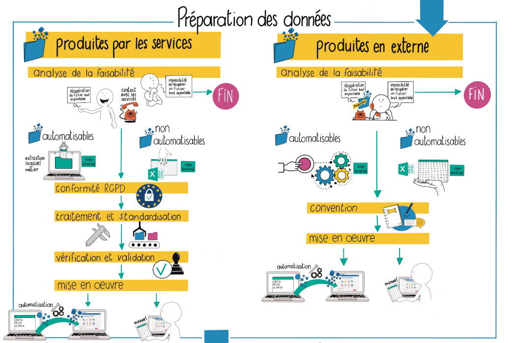

---

### Dernière étape : la publication

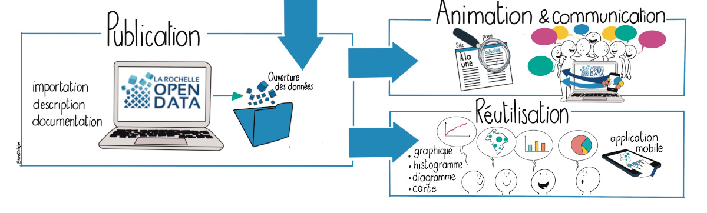

---

background-image: url("https://media.giphy.com/media/l1IY0geomfz09dEB2/giphy.gif")
class: center, top, inverse

# 3 - La qualité des données

---

### A la recherche des critères

De nombreux travaux ont tenté d'objectiver la notion de **qualité**. Parmi les plus éclairants, on peut signaler les travaux de Toronto Open Data et du [*"open data quality group"*](https://docs.google.com/presentation/d/1yFaPN_aL4D8h__3kTQ9GAc970nkroQaY/) qui a tenté de standardiser une série de critères [intégrés à sa plateforme](https://medium.com/open-data-toronto/towards-a-data-quality-score-in-open-data-part-1-525e59f729e9).

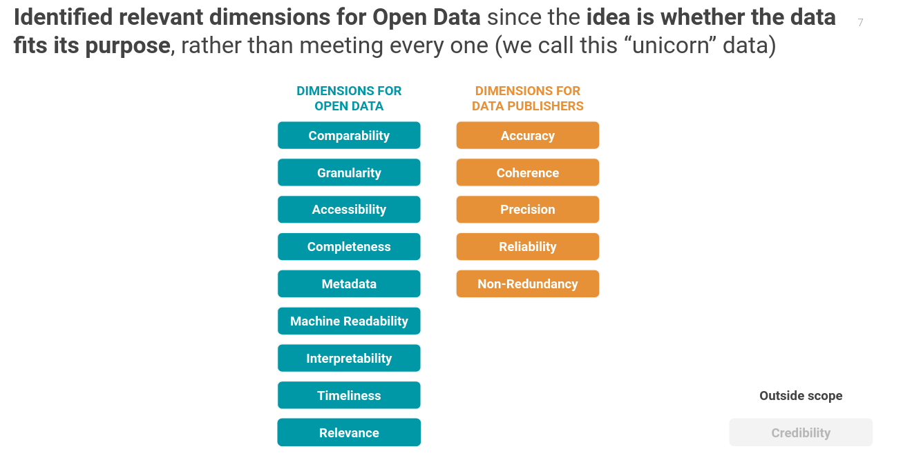

---

### A la recherche d'une méthode

.pull-left[#### [Organizing data in spreadsheets](http://kbroman.org/dataorg/) - K. Broman

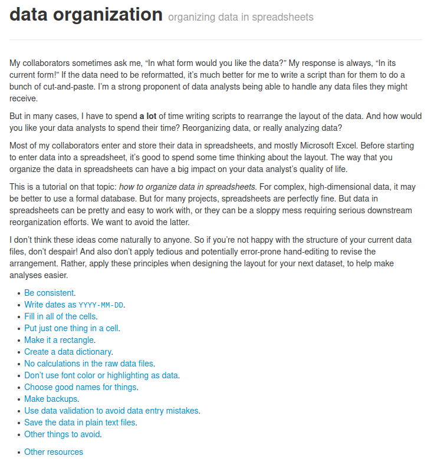

]

.pull-right[#### Les [72 règles](https://checklists.opquast.com/fr/assurance-qualite-web/download/) d'Opquast
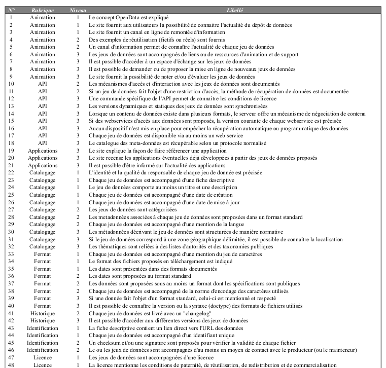
]

---

background-image: url("https://media.giphy.com/media/3ohhwidvE9BjiKOnXa/giphy.gif")
class: center, top, inverse

### Mot clef : l'interopérabilité

.footnote[Une source de référence : [Recommandations pour favoriser l'interopérabilité des données open data](https://docs.google.com/document/d/1rcv5hPVm372yZH9WbhRin4wsEBqiDJ4PG7LO6OmINhI/edit#heading=h.o0t9u2ur9hmk), OpenDataFrance, 2018.]

---

### Les normes ISO

.pull-left[Les normes ISO constituent un outil puissant d'interopérabilité des données : référencées au niveau international, elles assurent la lisibilité par la plupart des outils et peuvent être intégrés à la documentation des jeux de données.

Si leur couverture n'est pas intégrale, elles permettent d'assurer une cohérence et la qualité de bons nombres de types de données courants :
* monnaie ;
* nom des pays ;
* nom des langues ;
* etc.
]

--

.pull-right[#### Exemple de l'enfer : les dates (illustration : [xkcd](https://xkcd.com/1179/))

]

---

background-image: url("https://media.giphy.com/media/3orif2JK8DsUSxMShW/giphy.gif")
class: center, top, inverse

### Des licences lisibles

---

### Utiliser des outils de validation

l'évaluation de la qualité des données nécessite également une perspective globale : données manquantes, distribution aberrante, variables mal renseignées ... n'apparaissent qu'avec un peu de recul.

[WTF CSV](https://www.databasic.io/en/wtfcsv/) (*pardon my English*) permet par exemple de produire un rapport bref et visuel sur les différentes variables, valeurs manquantes et autres critères sur la base d'un CSV uploadé sur le site.

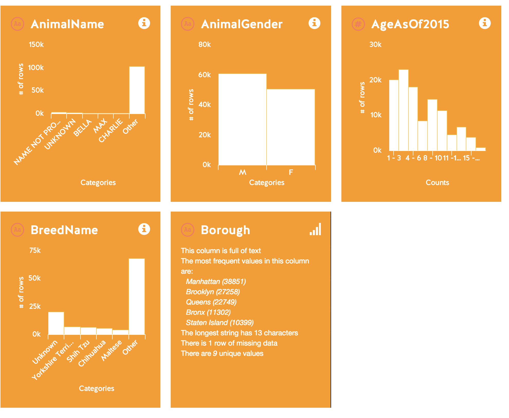

---

## Standards en usage

---

### Success story : le [GTFS](https://developers.google.com/transit) de Google

---

#### Exemple : [les jeux de données en GTFS](https://opendata.agglo-larochelle.fr/portail?search=gtfs) sur open data La Rochelle

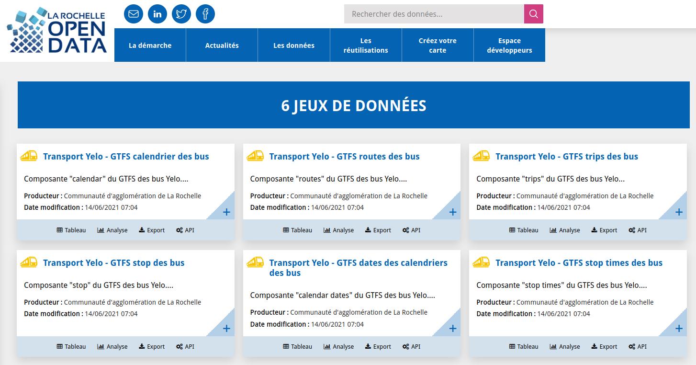

---

### [DAE](https://schema.data.gouv.fr/arsante/schema-dae/latest.html) : un format qui sauve des vies !

.center[
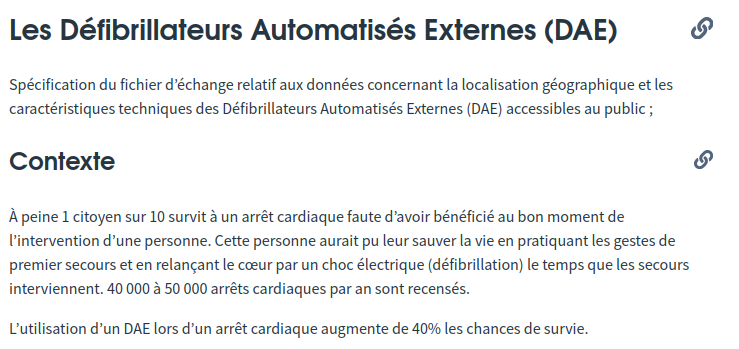
]

---

#### Exemple : [les défibrilateurs à La Rochelle](https://opendata.agglo-larochelle.fr/visualisation/information/?id=7b7933dc-0377-452a-85d5-9352f4a817b7&location=13,46.16543,-1.1238&basemap=Plan.ign.v2)

.center[
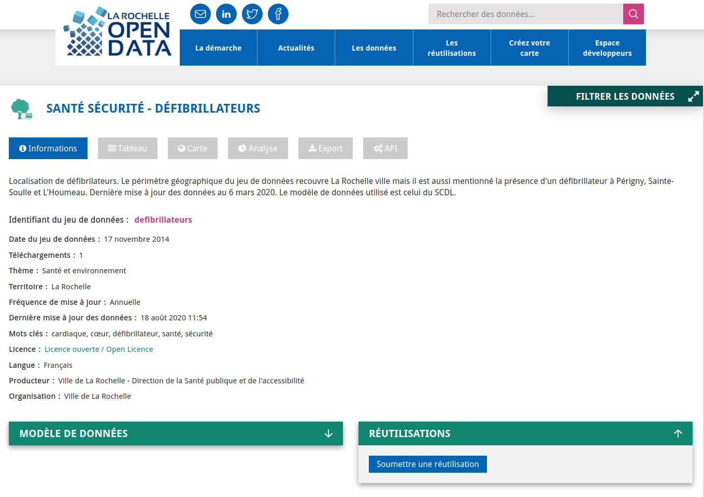
]

---

### Une référence française : [le SCDL](https://scdl.opendatafrance.net/docs/)

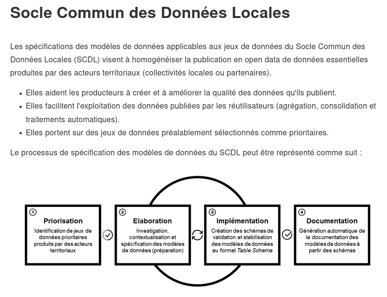

---

### Un répertoire officiel

[Schema.data.gouv.fr](https://schema.data.gouv.fr/) répertorie les standards en usage dans les administrations.

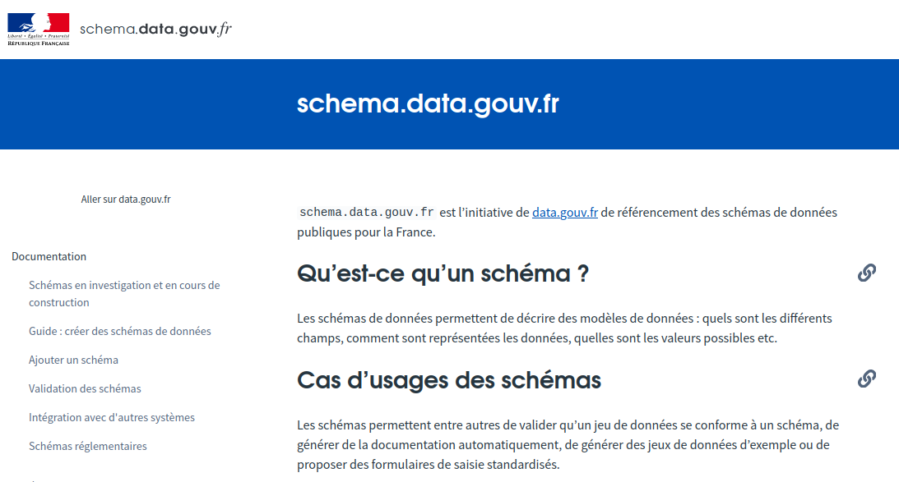

---

background-image: url("https://media.giphy.com/media/XHVmD4RyXgSjd8aUMb/giphy.gif")
class: center, top, inverse

### Avez-vous des questions? Des remarques?

---
class: inverse, center, middle

# Merci !

Contact : [sylvain@datactivist.coop](mailto:sylvain@datactivist.coop)
